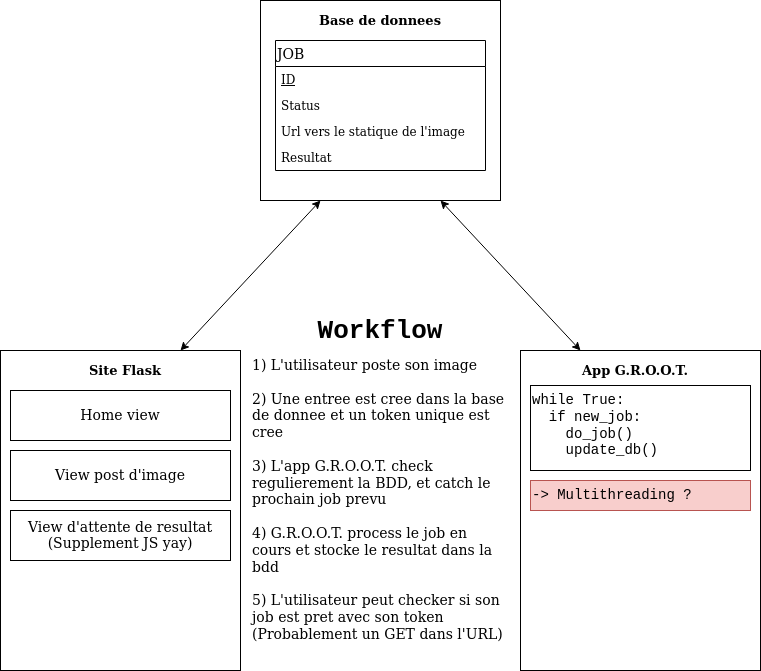

# G.R.O.O.T.
Grande reconnaissance d'Ortilles, d'Oseilles et de Te-plan

Le projet est séparé en deux parties, un site web, et une intelligence artificielle. Les deux communiquent ensemble en suivant le schéma suivant :

TODO:
* [ ] Finir le site web
* [ ] Faire une IA en fait MDR
* [X] Ajouter l'app de l'IA dans le docker-compose

Dataset :
[href](https://www.kaggle.com/msheriey/104-flowers-garden-of-eden?select=jpeg-311x311)